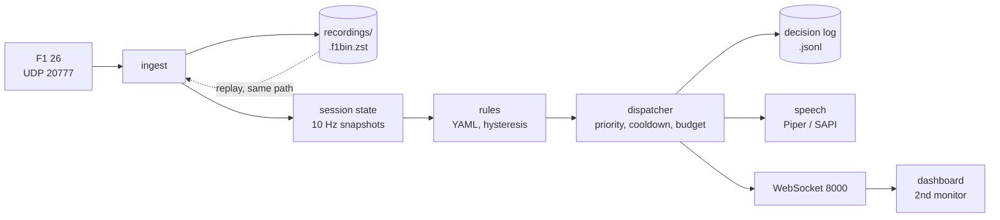

# f1-pitwall

A race engineer for F1 26. It reads the game's UDP telemetry, keeps a model of
the session, decides what is worth saying, says it over your headset, and shows
it on a second monitor. Everything runs locally on the game PC; nothing leaves it.

- **Status and milestones:** [docs/status.md](docs/status.md)
- **Docs site:** https://artsworks.github.io/f1-pitwall/
- **Lessons from live sessions (ADRs):** [docs/adr/](docs/adr/README.md)

## Quick start (Windows game PC)

You need Git and [uv](https://docs.astral.sh/uv/). uv installs Python 3.12 for
you, so nothing else is required. In PowerShell:

```powershell
# 1. Install uv (Astral's official installer; ByPass applies to this one command only)
powershell -ExecutionPolicy ByPass -c "irm https://astral.sh/uv/install.ps1 | iex"
# close and reopen PowerShell so `uv` is on PATH

# 2. Get pitwall
git clone https://github.com/artsworks/f1-pitwall.git
cd f1-pitwall
uv sync                      # creates .venv with Python 3.12 and all dependencies

# 3. Optional: natural voice (~60 MB download into voices/, git-ignored)
uv run pitwall voices get

# 4. Check the setup, then run
uv run pitwall speak         # radio check through your headset
uv run pitwall doctor        # ports, wire format, packet rate, speech
uv run pitwall start         # engine + speech + dashboard
```

Then in F1 26, **Settings → Telemetry Settings**:

| Setting | Value |
|---|---|
| UDP Telemetry | On |
| UDP Broadcast Mode | Off |
| UDP IP Address | `127.0.0.1` |
| UDP Port | `20777` |
| UDP Send Rate | `30 Hz` |
| UDP Format | `2026` |

Open `http://localhost:8000` on the second monitor (`/radio` is the compact
log view). You should hear "Pit wall online." on start, and the dashboard goes
LIVE as soon as you are on track (the game sends nothing from the menus).

To update later: `git pull; uv sync`.

### If something is off

| Symptom | Fix |
|---|---|
| `uv` not recognised after install | Reopen PowerShell, or run `$env:Path += ";$env:USERPROFILE\.local\bin"` |
| Dashboard says STALE | Run `uv run pitwall doctor --seconds 30` *while driving*. `0 datagrams` → check the game settings above, restart the game after changing them, then allow UDP 20777 in Windows Firewall (doctor prints the `netsh` commands). |
| No speech | `uv run pitwall speak` prints the error. `--engine sapi` uses the built-in Windows voice; `--engine piper` the downloaded one. |
| Robotic voice | `uv run pitwall voices get`, then restart `pitwall start`. |

More in [docs/getting-started.md](docs/getting-started.md).

## What it says today

| Call | When |
|---|---|
| Out-lap tyre check | Entering sector 3 of the out-lap: "still coming in" with temperatures, or "tyres are in, good to push" |
| Front wing damage | Wing damage ≥ 15 %, with left/right percentages |
| Boost left on | ERS boost on for 3 s and you lift or brake, or 12 s regardless |
| Yellow flag | Ahead within 800 m: careful, no overtaking. Appeared behind you: you're clear |
| Lock-up | After the wheel releases; front → ease brake pressure, rear → move brake bias forward |

Every call is a rule in [`src/pitwall/config/defaults/rules/shared.yaml`](src/pitwall/config/defaults/rules/shared.yaml)
with thresholds in [`thresholds.yaml`](src/pitwall/config/defaults/thresholds.yaml).

## Shape of the system



Recordings replay through the same ingest → state → rules path, so every rule
is tuned and tested offline against real sessions instead of by driving another race.

## Recording and replay

Every session is recorded under `recordings/` (local only, git-ignored).
The default `lite` profile is about 35 MB per 3 hours; use `--record full`
when you want a session for debugging.

```powershell
uv run pitwall start --record full                      # everything at 30 Hz
uv run pitwall replay recordings\<file>.f1bin.zst --speed 10 --stats
uv run pitwall replay recordings\<file>.f1bin.zst --serve   # watch it on the dashboard
```

## Why it is not just another dashboard

Gauges are a solved problem. The value here is judgement: knowing that the
undercut is worth 1.2 seconds, that there are three laps of life left in the
fronts at this pace, and, above all, knowing when to stay silent.

- **Record and replay.** Strategy logic is tuned offline against recordings.
- **Rules as data.** Each call is a declarative rule with its own hysteresis,
  cooldown and phrasing, so tuning is a config edit and every rule has a replay test.
- **A mindset you set.** Balanced or aggressive: one control that biases pit
  windows, energy, tyre management and which rival it watches.

## Documents

**Use**

| Document | Contents |
|---|---|
| [`docs/status.md`](docs/status.md) | Milestone progress, what works today, what is next |
| [`docs/getting-started.md`](docs/getting-started.md) | Install, game settings, doctor, recording profiles, replay, troubleshooting |
| [`docs/07-replay-and-debug.md`](docs/07-replay-and-debug.md) | Recording format, replay CLI, A/B diffing, live diagnostics |
| [`docs/08-configuration.md`](docs/08-configuration.md) | Settings model, verbosity presets, balanced/aggressive mindset |

**Design**

| Document | Contents |
|---|---|
| [`docs/01-architecture.md`](docs/01-architecture.md) | Layers, stack, cross-cutting decisions, repo layout |
| [`docs/02-ingestion.md`](docs/02-ingestion.md) | Packets consumed, parser design, pause/flashback, recording format |
| [`docs/03-strategy.md`](docs/03-strategy.md) | Rule format, pace and degradation model, pit loss, race and quali calls |
| [`docs/04-audio-ui.md`](docs/04-audio-ui.md) | Priorities, suppression, speech constraints, WebSocket protocol |
| [`docs/09-performance.md`](docs/09-performance.md) | Co-hosting with the game: stutter causes, budget, measurement |
| [`docs/12-driver-input.md`](docs/12-driver-input.md) | Wheel button and spacebar: acknowledge / negative |
| [`docs/13-league-multiplayer.md`](docs/13-league-multiplayer.md) | Friends-league target: restricted telemetry, league preset |
| [`docs/15-dashboard-design.md`](docs/15-dashboard-design.md) | Second-monitor dashboard design (implemented in `web/`) |

**Decisions and reference**

| Document | Contents |
|---|---|
| [`docs/adr/`](docs/adr/README.md) | Architecture decision records: what live sessions taught us |
| [`docs/05-roadmap.md`](docs/05-roadmap.md) | Milestones M0–M4 as vertical slices |
| [`docs/reference/f1-26-udp-notes.md`](docs/reference/f1-26-udp-notes.md) | Verified format-2026 packet facts |
| [`docs/00-review-of-v1.md`](docs/00-review-of-v1.md), [`06`](docs/06-direction-changes.md), [`10`](docs/10-angles-not-yet-considered.md), [`11`](docs/11-open-questions.md), [`14`](docs/14-adversarial-review.md) | Planning history: review of the first plan, direction changes, open angles and questions, adversarial review |

## Licence

GPLv3 — see [`LICENSE`](LICENSE).
